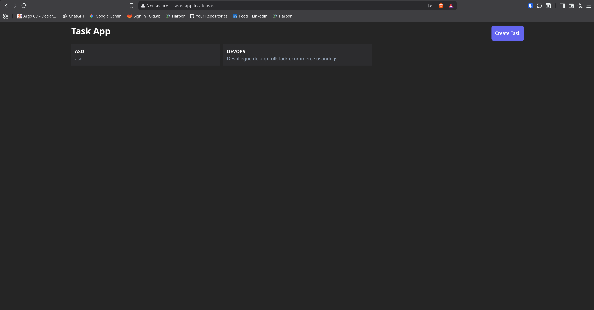

# 🖥️ TaskApp - Frontend TaskApp

Cliente web para la aplicación de tareas, desarrollado en **React**.

## 🛠️ Tecnologías utilizadas

* React
* React Hook Form
* Vite
* Axios (para peticiones API)

## 🚀 Configuración en Local

1. **Clonar el repositorio:**

    ```bash
      git clone https://github.com/yclicourt/frontend-tasks-app.git
      cd frontend-tasks-app
    ```

2. **Instalar las dependencias segun el manejador de paquetes de su preferencia**
    ```bash
      pnpm install
    ```

3. **Configurar la variable de entorno**
    - Crea un archivo .env en la raíz del proyecto:
    
    ```bash
      VITE_API_URL_PLACEHOLDER: http://URL_DEL_BACKEND:PORT/
    ```

4. **Levantar servidor de desarrollo**
    
    ```bash
      pnpm run dev
    ```

5. **📦 Construcción para Producción**
    - Para generar los archivos estáticos listos para producción (los cuales son  servidos luego en el contenedor de Kubernetes):

    ```bash
      pnpm run build
    ```
6. **🐳 Para crear la imagen docker**
   - Si se esta usando registry oficial(Docker Hub)
   
   ```bash
     docker build -t user/project:tag .
   ```

   - Si se esta usando un registry local(Harbor,Nexus)
   ```bash
     docker build -t harbor.local:frontend-tasks-app/frontend-tasks-app:latest .
     docker push harbor.local:frontend-tasks-app/frontend-tasks-app:latest
   ```

## 🚀 Imagenes de la App desplegada en el cluster
- Frontend TaskApp Desplegada


